# 软件设计说明书

> CSAPP 实验管理系统

## 目录

- [软件设计说明书](#软件设计说明书)
  - [目录](#目录)
  - [1. 引言](#1-引言)
    - [1.1. 目的](#11-目的)
    - [1.2. 范围](#12-范围)
    - [1.3. 定义与缩写](#13-定义与缩写)
    - [1.4. 参考](#14-参考)
  - [2. 体系结构设计](#2-体系结构设计)
    - [2.1. 注意事项](#21-注意事项)
      - [2.1.1. 设计选项](#211-设计选项)
      - [2.1.2. 假设](#212-假设)
      - [2.1.3. 约束条件](#213-约束条件)
    - [2.2. 系统级期望行为](#22-系统级期望行为)
    - [2.3. 体系结构的逻辑表示](#23-体系结构的逻辑表示)
    - [2.4. 体系构件概述](#24-体系构件概述)
    - [2.5. 流程框架](#25-流程框架)
    - [2.6. 部署架构](#26-部署架构)
  - [3. 组件设计](#3-组件设计)
    - [3.1. 后端 API 服务](#31-后端-api-服务)
      - [3.1.1. 概述](#311-概述)
      - [3.1.2. 对象模型](#312-对象模型)
      - [3.1.3. 场景](#313-场景)
        - [3.1.3.1. 用户登录](#3131-用户登录)
        - [3.1.3.2. 教师添加新的学生](#3132-教师添加新的学生)
        - [3.1.3.3. 教师用户删除特定学生账户](#3133-教师用户删除特定学生账户)
        - [3.1.3.4. 教师查看所有学生列表信息](#3134-教师查看所有学生列表信息)
        - [3.1.3.5. 教师查看学生实验解答列表](#3135-教师查看学生实验解答列表)
        - [3.1.3.6. 教师下载单个提交文件](#3136-教师下载单个提交文件)
        - [3.1.3.7. 教师更新学生个人信息](#3137-教师更新学生个人信息)
        - [3.1.3.8. 教师上传实验教学材料](#3138-教师上传实验教学材料)
        - [3.1.3.9. 教师删除实验教学材料](#3139-教师删除实验教学材料)
        - [3.1.3.10. 学生上传实验解决方案](#31310-学生上传实验解决方案)
        - [3.1.3.11. 学生查看提交列表](#31311-学生查看提交列表)
        - [3.1.3.12. 学生下载个人实验提交文件](#31312-学生下载个人实验提交文件)
        - [3.1.3.13. 学生删除个人实验提交文件](#31313-学生删除个人实验提交文件)
      - [3.1.4. 组件类设计](#314-组件类设计)
      - [3.1.5. 算法](#315-算法)
      - [3.1.6. 接口](#316-接口)
      - [3.1.7. 依赖（相关性）](#317-依赖相关性)
      - [3.1.8. 错误处理](#318-错误处理)
    - [3.2. Web 前端应用](#32-web-前端应用)
      - [3.2.1. 概述](#321-概述)
      - [3.2.2. 对象模型 (主要状态/数据)](#322-对象模型-主要状态数据)
      - [3.2.3. 场景 (部分示例)](#323-场景-部分示例)
      - [3.2.4. 组件类设计 (高层结构)](#324-组件类设计-高层结构)
      - [3.2.5. 算法/逻辑](#325-算法逻辑)
      - [3.2.6. 接口](#326-接口)
      - [3.2.7. 依赖（相关性）](#327-依赖相关性)
      - [3.2.8. 错误处理](#328-错误处理)
      - [3.2.9. GUI 实体模型](#329-gui-实体模型)
  - [4. 未解决问题列表](#4-未解决问题列表)

## 1. 引言

### 1.1. 目的

本文档旨在完成对 CSAPP 实验管理系统的详细设计，达到指导后续软件构造的目的，同时实现和测试人员及用户的沟通。

本报告面向开发人员、测试人员及最终用户而编写，是了解系统的导航。

### 1.2. 范围

本文档定义了 CSAPP 实验管理系统的软件设计。该系统旨在为 CS:APP (Computer Systems: A Programmer's Perspective) 课程实验提供管理支持，主要功能包括：

- 用户管理（教师、学生角色区分）
- 实验管理（实验信息、实验材料发布）
- 学生实验方案提交与管理
- 基于 Web 的用户交互界面

### 1.3. 定义与缩写

- **CS:APP**:《深入理解计算机系统》（英文原名：_Computer Systems A Programmer's Perspective_）
- **Spring Boot**: Java 开发框架，用于构建后端服务
- **Spring Security**: 来自 Spring 的用于实现身份认证和鉴权的开发库
- **RBAC**:“基于角色的访问控制”（Role-Based Access Control）
- **JWT**: JSON Web Token，一种基于 JSON 格式的令牌格式
- **DTO**: Data Transfer Object，数据传输对象，一般是实体类所含属性的子集
- **PostgreSQL**: 关系型数据库管理系统
- **S3**：指的是最初由 Amazon 推出的 Simple Storage Service。
- **S3 兼容服务**：指的是兼容 Amazon S3 的各类服务，例如 MinIO。
- **MinIO**: 一个开源的、兼容 S3 的对象存储服务
- **NextJS**: React 框架，用于构建前端用户界面
- **SPA**: Single Page Application，单页应用，一种前端应用形式
- **Formik**: React 表单库
- **Radix UI**: 现代化的 React 组件库
- **Docker**: 容器化平台
- **Docker Compose**: 用于定义和运行多容器 Docker 应用程序的工具

### 1.4. 参考

- TODO

## 2. 体系结构设计

### 2.1. 注意事项

#### 2.1.1. 设计选项

- **技术栈**: 采用前后端分离架构。后端选用 Java + Spring Boot 构建 RESTful API 服务；前端选用 TypeScript + NextJS 构建用户界面。
- **数据库**: 使用 PostgreSQL 存储结构化数据（如用户信息、实验信息）。
- **文件存储**: 使用兼容 S3 的对象存储服务（如 MinIO）存储非结构化数据（如实验材料、学生提交的解决方案）。
- **认证**: 采用基于 Spring Security 的 Basic Authentication 和 JWT 进行 API 保护和用户认证。
- **部署**: 提供 Docker Compose 配置，支持本地一键化部署整个系统（包括前后端服务、数据库、对象存储）。

#### 2.1.2. 假设

- 假设部署环境支持 Docker 及 Docker Compose。
- 假设部署环境存在足够的磁盘空间用于数据持久化。
- 假设部署环境支持校园网访问。
- 假设用户（学生/教师）具备基本的 Web 浏览器使用能力。

#### 2.1.3. 约束条件

- 后端 API 需遵循 RESTful 设计原则。
- 文件存储需使用兼容 S3 的接口，且 MinIO 需要配置为路径样式访问 (Path-style Access)。
- 系统安全性依赖于 Spring Security 配置及 JWT 机制。

### 2.2. 系统级期望行为

系统旨在支持 CSAPP 课程实验的教学流程：

- **用户登录**: 教师和学生通过系统认证登录。
- **教师操作**:
  - 管理实验信息（创建、发布、修改）。
  - 上传实验材料至对象存储。
  - 查看学生提交的实验解决方案。
- **学生操作**:
  - 浏览已发布的实验信息。
  - 下载实验材料。
  - 提交实验解决方案（上传文件至对象存储）。
  - 查看自己的提交记录。

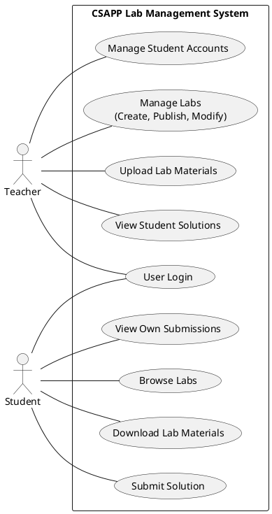

### 2.3. 体系结构的逻辑表示

系统“客户端-服务器”架构与“分层架构”的组合模式，遵循 N-Tier 架构设计原则，实现关注点分离和层次化抽象。

- **表示层 (Web 前端界面):** 基于 NextJS 构建的 SPA，负责用户交互和数据展示，通过调用后端 RESTful API 获取和提交数据。
- **应用层：**
  - **API Gateway**: 基于 Spring Boot 的 REST 控制器，处理 HTTP 协议转换和基础验证
  - **控制器层 (Controller Layer)**：实现端点路由、DTO 转换和请求验证等
  - **模型层 (Model Layer)**: 相关实体类的表示等
- **业务逻辑层**: 处理业务逻辑（用户管理、实验管理、方案管理）、用户认证、数据校验，并与数据持久层交互。
- **数据持久层:**
  - **数据库:** PostgreSQL，存储用户、角色、实验元数据等结构化信息。
  - **对象存储:** S3 兼容服务（如 MinIO），存储实验材料、学生提交文件等非结构化数据。

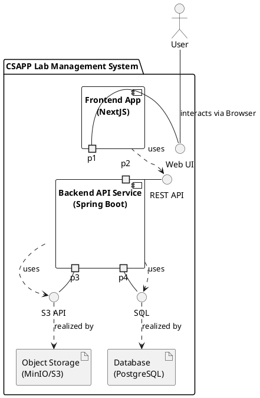

### 2.4. 体系构件概述

系统主要由以下软件构件组成：

- **前端 Web 应用:** 使用 NextJS 开发的单页应用 (SPA)，运行在用户的浏览器环境中。
- **后端 API 服务:** 使用 Spring Boot (Java) 开发的后端服务，提供 API 接口供前端调用。
- **数据库服务:** PostgreSQL 实例，负责数据存储与检索。
- **对象存储服务:** 兼容 S3 的服务实例（如 MinIO），负责文件存储与检索。
- **工具脚本:** Python 脚本 (如`add_students.py`)，用于批量创建系统用户和服务器用户（适用于有限的特定场景）。

### 2.5. 流程框架

- **认证流程:** 用户在前端输入凭证 -> 前端调用后端登录 API -> 后端验证凭证 (Spring Security) -> 成功则生成 JWT 返回给前端 -> 前端保存 JWT 并在后续请求中携带。
- **实验材料上传流程 (教师):** 教师在前端选择文件 -> 前端调用后端上传 API -> 后端验证权限 -> 后端将文件流式传输到 S3 对象存储 -> 后端更新数据库中的实验元数据。
- **解决方案提交流程 (学生):** 学生在前端选择文件 -> 前端调用后端提交 API -> 后端验证权限 -> 后端将文件存储到 S3 对象存储（按指定路径结构 `labs/{labId}/solutions/{studentId}/{fileName}`） -> 后端更新数据库记录。

### 2.6. 部署架构

系统设计为可通过 Docker Compose 进行本地或服务器部署。`docker-compose.yml` 文件定义了以下服务：

- `frontend`: NextJS 应用容器。
- `backend`: Spring Boot 应用容器。
- `postgres`: PostgreSQL 数据库容器。
- `minio`: MinIO (S3 兼容) 对象存储容器。  

数据库和对象存储服务的凭证等敏感信息可以通过环境变量配置。同时，这些环境变量本身也支持使用 `.env`配置。

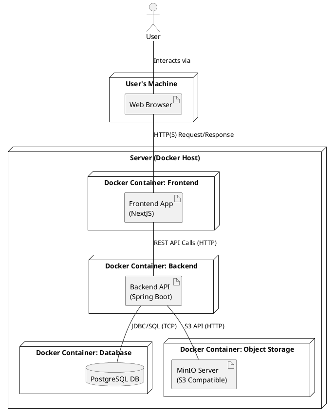

## 3. 组件设计

### 3.1. 后端 API 服务

#### 3.1.1. 概述

该组件是基于 Spring Boot 框架构建的 RESTful API 服务，采用 Java 语言编写。它承担了系统的核心职责，包括处理 HTTP 请求、执行业务逻辑、管理用户认证与授权、与 PostgreSQL 数据库交互进行数据持久化，以及与 S3 兼容的对象存储服务（如 MinIO）交互进行文件管理。该服务采用分层架构设计，主要包括 Controller 层、Service 层、Repository 层和 Model 层。

#### 3.1.2. 对象模型

后端服务主要处理以下核心对象模型：

- **实体 (Entities - **`model`** 包)**：
  - `SystemUser`: 代表系统用户，包含 `id` (`Long`), `username` (`String`, unique, non-null), `password` (`String`, non-null, BCrypt hash), 以及 `roles` (`Set<String>`, e.g., "TEACHER", "STUDENT")。通过 `@Entity` 映射到数据库表 `my_system_user_table`。角色存储在关联表 `my_role_table`。
  - `LabInfo`: 代表实验信息，包含 `id` (`Long`), `name` (`String`, unique, non-null), `description` (`String`, TEXT)。通过 `@Entity` 映射到数据库表 `my_lab_info_table`。
- **数据传输对象 (DTOs - **`dto`** 包)**：用于 API 请求和响应的数据载体。
  - `LoginRequest`: 包含 `username` 和 `password` 用于登录请求。
  - `LoginResponse`: 包含 `username`, `roles` (`Collection<String>`), 和 `token` (`String`, JWT) 用于登录成功响应。
  - `AddOrUpdateStudentRequest`: 包含 `studentId` 和 `rawPassword` 用于教师添加或更新学生密码的请求。

#### 3.1.3. 场景

##### 3.1.3.1. 用户登录

1. 用户通过客户端（前端）提交用户名和密码 (`LoginRequest`) 到 `/api/auth/login` 端点。
2. `AuthController` 调用 `AuthService.authenticate()`。
3. `AuthService` 使用 Spring `AuthenticationManager` 验证凭据。
4. 验证成功后，`AuthService` 生成 JWT Token，封装成 `LoginResponse` 返回。

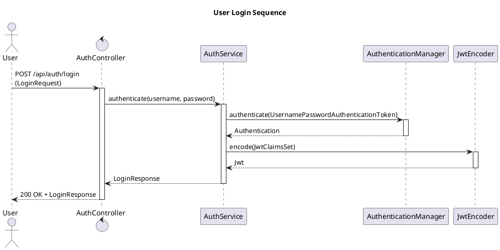

##### 3.1.3.2. 教师添加新的学生

1. 教师通过客户端提交学生 ID 和密码 (`AddOrUpdateStudentRequest`) 到 `/api/teachers/students` 端点 (需携带 JWT Token 且具有 TEACHER 角色)。
2. `JwtAuthenticationFilter` 和 `SecurityConfig` 验证权限。
3. `TeacherController` 调用 `SystemUserService.addStudent()`。
4. `SystemUserService` 加密密码，创建 `SystemUser` 实体（角色 "STUDENT"），调用 `SystemUserRepository.save()` 存入数据库。
5. `TeacherController` 返回 201 Created 响应。

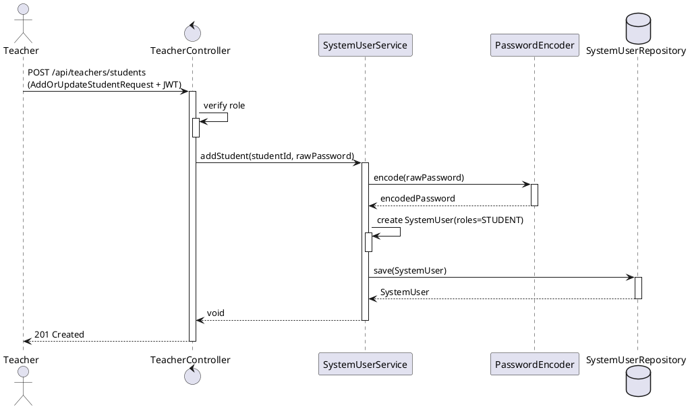

##### 3.1.3.3. 教师用户删除特定学生账户

1. 教师通过客户端发送 `DELETE` 请求到 `/api/teachers/students/{studentId}` 端点（需携带 JWT Token 且具有 TEACHER 角色）。
2. `JwtAuthenticationFilter` 和 `SecurityConfig` 验证 Token 及权限。
3. `TeacherController` 调用 `SystemUserService.removeStudent(studentId)`。
4. `SystemUserService` 通过 `SystemUserRepository.deleteById(studentId)` 删除数据库中的 `SystemUser` 实体。
5. `TeacherController` 返回 `200 OK` 响应（若成功）或 404 Not Found（若学生不存在）。

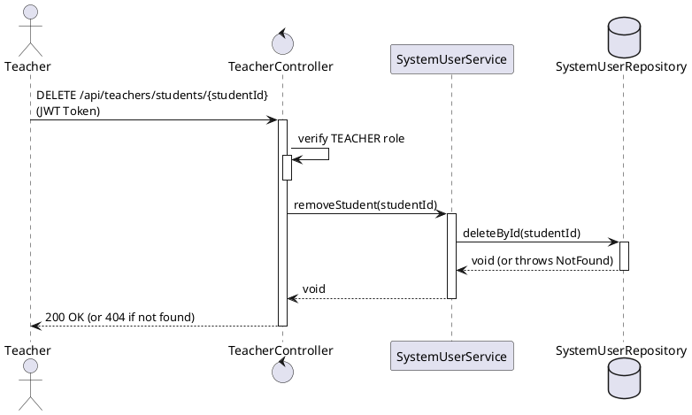

##### 3.1.3.4. 教师查看所有学生列表信息

1. 教师访问 `GET /api/teachers/students` 端点（需 TEACHER 角色和有效 JWT）。
2. `JwtAuthenticationFilter` 验证 Token 权限。
3. `TeacherController` 调用 `SystemUserService.getAllStudents()`。
4. `SystemUserService` 通过 `SystemUserRepository.findByRole("STUDENT")` 查询学生列表。
5. 返回 `200 OK` 和 `List<StudentDTO>`（含学号、用户名等基础信息）。

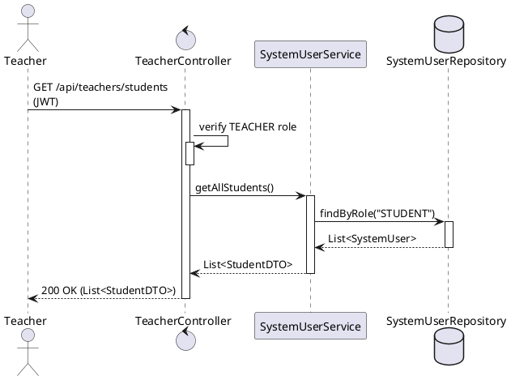

##### 3.1.3.5. 教师查看学生实验解答列表

1. 教师访问 `GET /api/teachers/labs/{labId}/solutions` 端点（需 TEACHER 角色）。
2. `JwtAuthenticationFilter` 验证权限。
3. `TeacherController` 调用 `LabService.getLabSolutions(labId)`。
4. `LabService` 通过 `LabSolutionRepository.findByLabId(labId)` 查询提交记录，并检查 MinIO 文件是否存在。
5. 返回 `200 OK` 和 `List<SolutionDTO>`（含学生 ID、文件名、提交时间）。

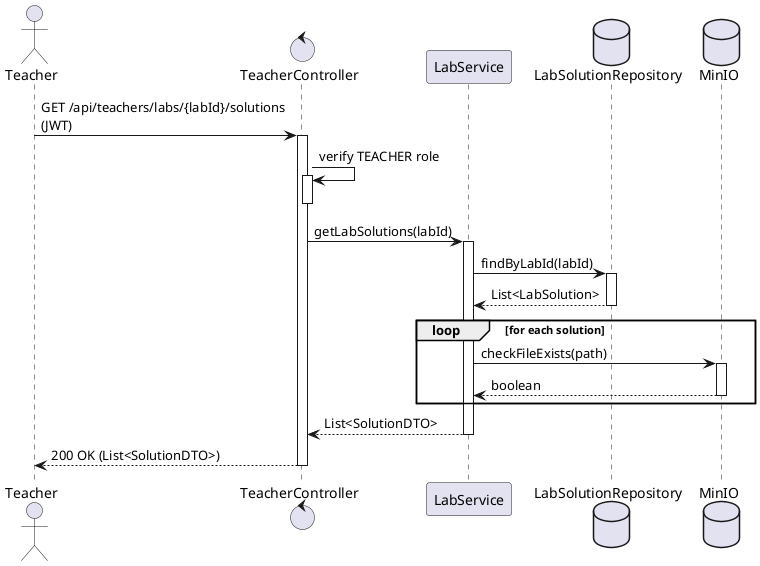

##### 3.1.3.6. 教师下载单个提交文件

1. 教师通过客户端访问 `/api/teachers/labs/{labId}/solutions/{studentId}/{fileName}` 端点（需携带 JWT Token）。
2. `JwtAuthenticationFilter` 验证 Token。
3. `TeacherController` 调用 `OssService.downloadFile()`，传入对象路径 `labs/{labId}/solutions/{studentId}/{fileName}`。
4. `OssService` 从 MinIO 获取文件流并返回。
5. `TeacherController` 返回 `200 OK` 响应，附带文件流（Resource）及下载头信息。

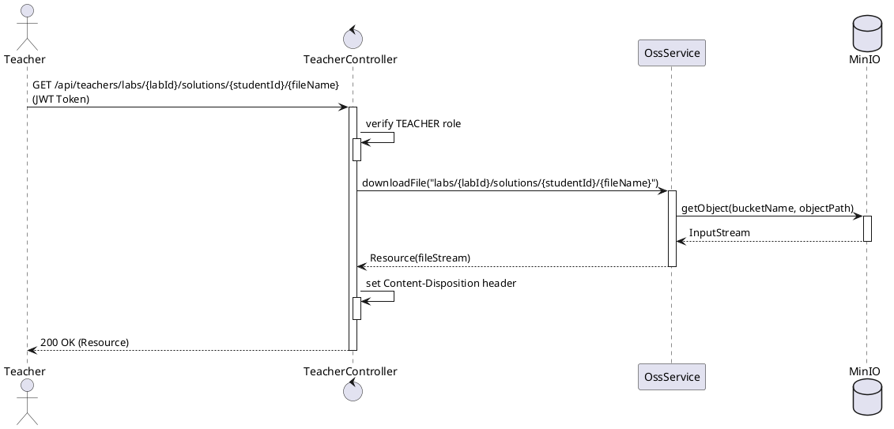

##### 3.1.3.7. 教师更新学生个人信息

1. 教师通过客户端提交学生ID和新密码 (`UpdateStudentRequest`) 到 `/api/teachers/students/{studentId}` 端点（`PUT`，需JWT Token + TEACHER 角色）。
2. `JwtAuthenticationFilter` 和 `SecurityConfig` 验证权限。
3. `TeacherController` 调用 `SystemUserService.updateStudent()`。
4. `SystemUserService` 使用 `PasswordEncoder` 加密新密码，通过 `SystemUserRepository.save()` 更新数据库。
5. 返回 `200 OK` 响应。

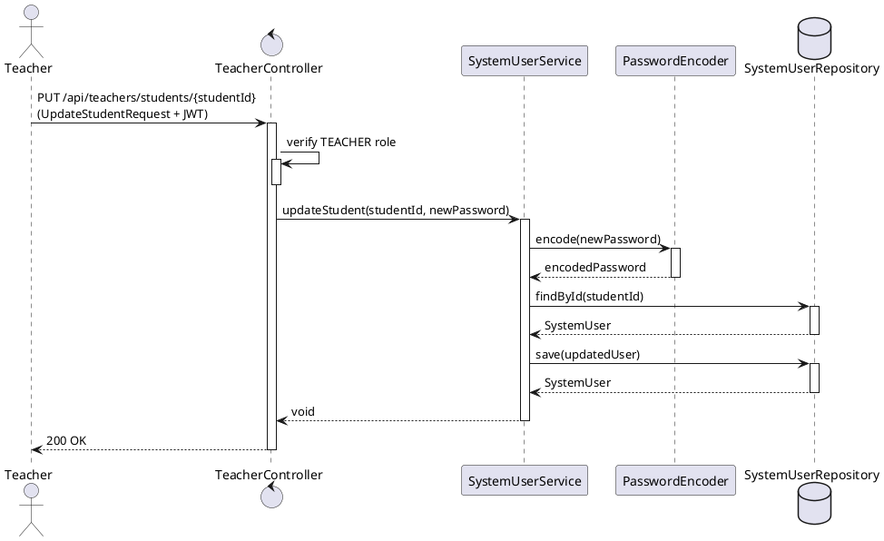

##### 3.1.3.8. 教师上传实验教学材料

1. 教师通过客户端上传文件到 `/api/teachers/labs/{labId}/materials` 端点（`POST`，需JWT + TEACHER 角色）。
2. `JwtAuthenticationFilter` 验证权限。
3. `TeacherController` 调用 `OssService.uploadFile()`，路径格式为 `labs/{labId}/materials/{fileName}`。
4. `OssService` 将文件上传至MinIO存储。
5. 返回 `201 Created` 响应。

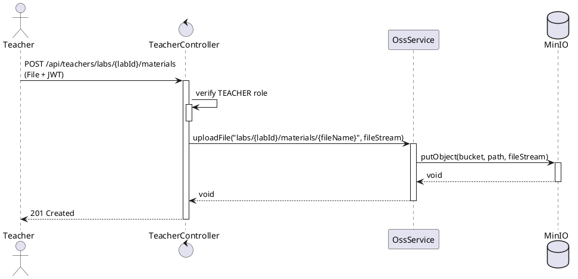

##### 3.1.3.9. 教师删除实验教学材料

1. 教师请求删除 `/api/teachers/labs/{labId}/materials/{fileName}` 端点（`DELETE`，需JWT + TEACHER 角色）。
2. `JwtAuthenticationFilter` 验证权限。
3. `TeacherController` 调用 `OssService.deleteFile()`，路径为 `labs/{labId}/materials/{fileName}`。
4. `OssService` 从MinIO删除文件（无论是否存在）。
5. 返回 `200 OK`（幂等性设计）。

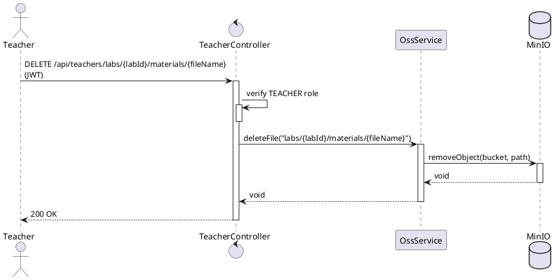

##### 3.1.3.10. 学生上传实验解决方案

1. 学生在客户端选择文件，提交到 `/api/students/labs/{labId}/solutions` 端点 (需携带 JWT Token)。
2. `JwtAuthenticationFilter` 验证 Token。
3. `StudentController` 获取学生 ID，校验文件。
4. `StudentController` 调用 `OssService.uploadFile()`，传入对象名 (`labs/{labId}/solutions/{studentId}/{fileName}`) 和文件流。
5. `OssService` 上传文件到 S3 对象存储。
6. `StudentController` 返回 `201 Created` 响应。

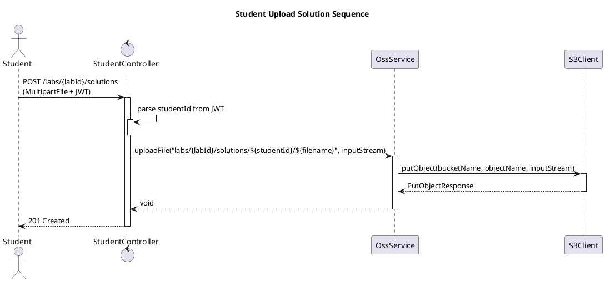

##### 3.1.3.11. 学生查看提交列表

1. 学生访问 `/api/students/labs/{labId}/solutions` 端点（携带 JWT Token）。
2. `JwtAuthenticationFilter` 验证 Token 及 STUDENT 角色。
3. `StudentController` 调用 `LabService.getStudentSolutions(labId, studentId)`。
4. `LabService` 通过 `LabSolutionRepository` 查询该学生的提交记录（或从 MinIO 列出文件）。
5. 返回 `200 OK` 和 `List<SolutionDTO>`（含文件名、提交时间等）。

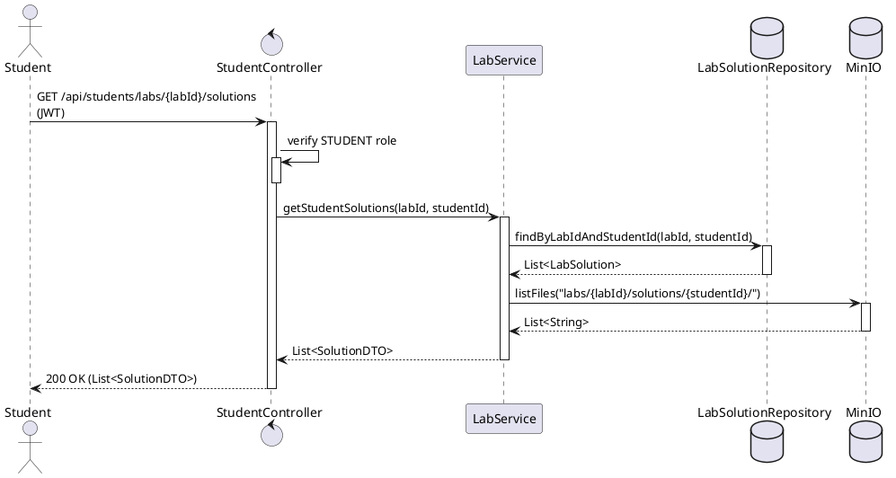

##### 3.1.3.12. 学生下载个人实验提交文件

1. 学生访问 `GET /api/students/labs/{labId}/solutions/{fileName}` 端点（需 STUDENT 角色和有效 JWT）。
2. `JwtAuthenticationFilter` 验证 Token 权限。
3. `StudentController` 调用 `OssService.downloadFile()`，路径为 `labs/{labId}/solutions/{studentId}/{fileName}`。
4. `OssService` 从 MinIO 获取文件流。
5. 返回 `200 OK` 和文件流（附带 `Content-Disposition` 头）。

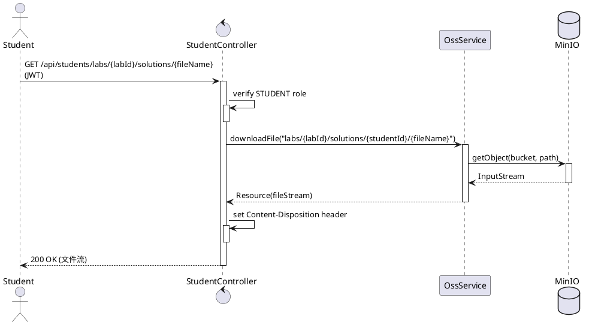

##### 3.1.3.13. 学生删除个人实验提交文件

1. 学生发送 `DELETE /api/students/labs/{labId}/solutions/{fileName}` 请求（需 STUDENT 角色）。
2. `JwtAuthenticationFilter` 验证权限。
3. `StudentController` 调用 `OssService.deleteFile()`，路径为 `labs/{labId}/solutions/{studentId}/{fileName}`。
4. `OssService` 删除 MinIO 中的文件（幂等操作）。
5. 返回 `200 OK`（无论文件是否存在）。

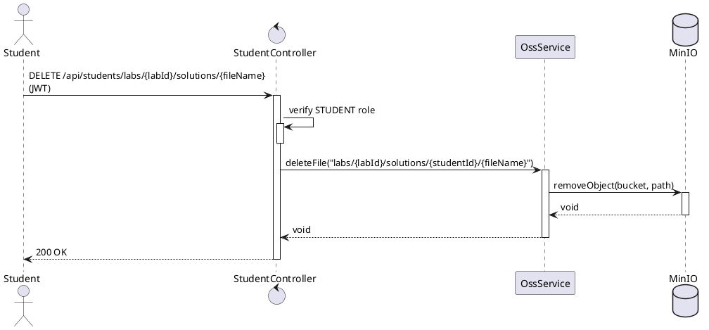

#### 3.1.4. 组件类设计

- `config`**包:**
  - `CorsConfiguration`: 配置 CORS 规则。
  - `JwtConfig`: 提供 JWT 相关 Bean (密钥对, Encoder, Decoder) 和 `PasswordEncoder` (BCrypt)。
  - `JwtAuthenticationFilter`: 实现 JWT 请求认证。
  - `OpenApiConfiguration`: 配置 OpenAPI 文档。
  - `SecurityConfig`: 定义 `SecurityFilterChain`，配置 URL 权限、Session 策略 (STATELESS)、集成 JWT 过滤器。
- `controller`**包:**
  - `AuthController`: 处理 `/api/auth/login`。
  - `PublicController`: 处理 `/api/public/**` 和 `/api/status`，提供公共信息查询和状态检查。
  - `StudentController`: 处理 `/api/students/**`，负责学生操作（解决方案上传/下载/删除/列表）。
  - `TeacherController`: 处理 `/api/teachers/**`，负责教师操作（学生管理、实验材料管理、查看学生解答）。
- `dto`**包:** 定义 API 数据传输对象 (`LoginRequest`, `LoginResponse`等)。
- `exceptions`**包:**
  - `GlobalExceptionHandler`: 统一处理特定异常并返回 HTTP 状态码。
- `model`**包:** 定义 JPA 实体 `SystemUser` 和 `LabInfo`。
- `repository`**包:**
  - `SystemUserRepository`: JpaRepository 接口，提供用户数据 CRUD 和查询。
  - `LabInfoRepository`: JpaRepository 接口，提供实验信息 CRUD。
  - `DataInitializer`: 实现 `CommandLineRunner`，初始化教师账户和实验信息。
- `service`**包:**
  - `AuthService`: 实现认证逻辑，生成 Token。
  - `OssService`: 封装 S3 客户端交互（上传/下载/列表/删除），启用路径样式访问。
  - `SystemUserDetailsService`: 实现 Spring Security `UserDetailsService`，加载用户数据。
  - `SystemUserService`: 实现用户管理业务逻辑。

```puml
@startuml Backend

title Backend - Spring Boot RESTful API

entity SystemUser {
  - id: Long
  - username: String
  - password: String
  - roles: Set<String>
  + getAuthorities(): Collection
}

entity LabInfo {
  - id: Long
  - name: String
  - description: String
}

interface LabInfoRepository <<Repository>> extends JpaRepository<LabInfo, Long> {
}

LabInfoRepository ..> LabInfo

interface SystemUserRepository <<Repository>> extends JpaRepository<SystemUser, Long> {
 + findByUsername(username: String): Optional<SystemUser>
  + findRolesByUsername(username: String): Optional<Set<String>>
  + findByRole(role: String): Set<SystemUser>
}

SystemUserRepository ..> SystemUser

class DataInitializer <<Component>> {
 - userRepository: SystemUserRepository
  - labInfoRepository: LabInfoRepository
  - passwordEncoder: PasswordEncoder
  - initTeacherUsername: String
  - initTeacherPassword: String
 + run(args: String...): void
}

DataInitializer o.. SystemUserRepository
DataInitializer o.. LabInfoRepository
DataInitializer o.. PasswordEncoder

class AddOrUpdateStudentRequest <<DTO>> {
 - studentId: String
 - rawPassword: String
}

class LoginRequest <<DTO>> {
 - username: String
 - password: String
}

class LoginResponse <<DTO>> {
 - username: String
 - roles: Collection<String>
 - token: String
}

class AuthService <<Service>> {
  - authenticationManager: AuthenticationManager
 - jwtEncoder: JwtEncoder
 + AuthService(authenticationManager, jwtEncoder)
 + authenticate(username: String, password: String): LoginResponse
 - generateToken(authentication: Authentication): String
}

AuthService ..> LoginResponse
AuthService o.. AuthenticationManager
AuthService o.. JwtEncoder

class OssService <<Service>> {
  - endpoint: String
  - bucketName: String
  - region: String
  - accessKeyId: String
  - secretAccessKey: String
  - s3Client: S3Client
  + init(): void
  + shutdown(): void
  + uploadFile(objectName: String, inputStream: InputStream): void
  + downloadFile(objectName: String): InputStream
  + listFiles(keyPrefix: String): List<String>
  + deleteFile(objectName: String): void
}

OssService *.. S3Client

class SystemUserDetailsService <<Service>> implements UserDetailsService {
  - systemUserRepository: SystemUserRepository
  + SystemUserDetailsService(systemUserRepository): SystemUserDetailsService
  + loadUserByUsername(username: String): UserDetails
  - getAuthrities(roles: Set<String>): Collection
}

SystemUserDetailsService *.. SystemUserRepository

class SystemUserService <<Service>> {
  - systemUserRepository：final SystemUserRepository
  - passwordEncoder: final PasswordEncoder
  + SystemUserService(systemUserRepository, passwordEncoder): SystemUserService
  + isTeacher(username: String): boolean
  + isStudent(username: String): boolean
  + addStudent(studentId: String, rawPassword: String): void
  + updateStudent(studentId: String, rawPassword: String): void
  + deleteStudent(studentId: String): void
  + getStudentNameList(): Set<String>
}

SystemUserService o.. SystemUserRepository
SystemUserService o.. PasswordEncoder

class AuthController <<Controller>> {
  - authService: final AuthService
  + AuthController(authService): AuthController
  + login(loginRequest: LoginRequest): ResponseEntity<LoginResponse>
}

AuthController o.. AuthService
AuthController ..> LoginRequest
AuthController ..> LoginResponse

class PublicController <<Controller>> {
  - ossService: OssService
  - labInfoRepository: LabInfoRepository
  + PublicController(ossService, labInfoRepository): PublicController
  + checkStatus(): ResponseEntity<String>
  + getLabs(): ResponseEntity<List<LabInfo>>
  + getLab(labId: Long): ResponseEntity<LabInfo>
  + getMaterials(labId: Long): ResponseEntity<List<String>>
  + getMaterialFile(labId: Long, fileName: String): ResponseEntity<InputStreamResource>
}

PublicController o.. OssService
PublicController o.. LabInfoRepository
PublicController ..> LabInfo

class StudentController <<Controller>> {
  - ossService: OssService
  + StudentController(ossService): StudentController
  + checkStatus(): ResponseEntity<String>
  + uploadSolution(labId: Long, file: MultipartFile): ResponseEntity<String>
  + downloadSolution(labId: Long): ResponseEntity<List<String>>
  + downloadSolutionFile(labId: Long, fileName: String): ResponseEntity<InputStreamResource>
  + deleteSolutionFile(labId: Long, fileName: String): void
}

StudentController o.. OssService

class TeacherController <<Controlller>> {
  - systemUserService: SystemUserService
  - ossService: OssService
  + TeacherController(systemUserService, ossService): TeacherController
  + checkStatus(): ResponseEntity<String>
  + getStudents(): ResponseEntity<Set<String>>
  + addStudent(request: AddOrUpdateStudentRequest): ResponseEntity<String>
  + updateStudent(studentId: String, request: AddOrUpdateStudentRequest): ResponseEntity<String>
  + deleteStudent(studentId: String): ResponseEntity<String>
  + uploadMaterial(labId: Long, file: MultipartFile): ResponseEntity<String>
  + deleteMaterialFile(labId: Long, fileName: String): ResponseEntity<String>
  + getSolution(labId: Long, studentId: StudentId): ResponseEntity<List<String>>
  + getSolutionFile(labId: Long, studentId: StudentId, fileName: String): ResponseEntity<InputStreamResource>
}

TeacherController o.. SystemUserService
TeacherController o.. OssService
TeacherController ..> AddOrUpdateStudentRequest

@enduml
```

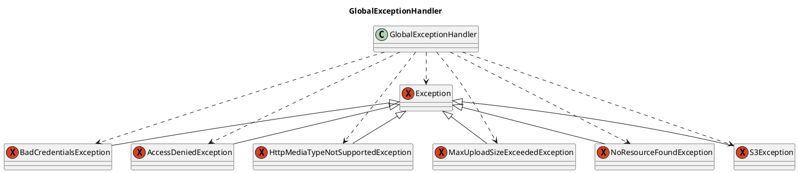

#### 3.1.5. 算法

- **密码存储:** 使用 BCrypt 哈希算法。
- **身份认证:**
  - **登录:** 使用 Spring Security 的 `AuthenticationManager` 配合 `DaoAuthenticationProvider` 进行数据库验证。
  - **Token 生成:** 认证成功后，使用 Nimbus JOSE+JWT 库生成 RSA 签名的 JWT，包含用户名和权限等 Claims。
  - **Token 验证:** `JwtAuthenticationFilter` 拦截请求，使用 `JwtDecoder` 验证 Token 签名和有效期。
- **对象存储路径生成:** 文件 Key (路径) 通过拼接固定前缀 (`labs`)、实验 ID、类型 (`materials` 或 `solutions`)、(可选) 学生 ID 和原始文件名生成，例如 `labs/{labId}/solutions/{studentId}/{fileName}`。

#### 3.1.6. 接口

- **外部接口 (REST API):** 由 `controller` 包提供，定义客户端交互契约。
  - `AuthController`: `POST /api/auth/login`
  - `PublicController`: `GET /api/public/**`, `GET /api/status`
  - `StudentController`: `POST/GET/DELETE /api/students/**` (需 STUDENT 角色)
  - `TeacherController`: `POST/GET/PUT/DELETE /api/teachers/**` (需 TEACHER 角色)
- **内部接口:**
  - `SystemUserDetailsService`: 实现 Spring Security `UserDetailsService`。
  - `SystemUserRepository`, `LabInfoRepository`: 实现 Spring Data `JpaRepository`。

#### 3.1.7. 依赖（相关性）

- **内部依赖:** Controller -> Service -> Repository。
- **外部依赖 (主要框架/库):** Spring Boot (Web, Security, Data JPA, OAuth2), Lombok, Hibernate, PostgreSQL Driver, AWS SDK v2 for S3, Nimbus JOSE+JWT, SpringDoc OpenAPI。

#### 3.1.8. 错误处理

系统采用全局异常处理机制 (`GlobalExceptionHandler`)，将特定 Java 异常映射为 HTTP 响应状态码和消息。例如 `BadCredentialsException` -> 401, `AccessDeniedException` -> 403, `S3Exception` -> 404/500。

### 3.2. Web 前端应用

#### 3.2.1. 概述

该组件是使用 NextJS (React 框架) 和 TypeScript 构建的单页应用程序 (SPA)，负责用户界面展示和交互。它通过调用后端 RESTful API 来获取数据、执行操作（如登录、上传文件）和管理用户会话。

#### 3.2.2. 对象模型 (主要状态/数据)

- `Auth`: 存储用户认证信息 (用户名, 角色, JWT Token, 过期时间)。
- `LabInfo`: 实验信息 (ID, 名称, 描述)。
- `FileList`: 文件列表 (字符串数组)。
- `StudentList`: 学生用户名列表 (字符串数组)。

#### 3.2.3. 场景 (部分示例)

- **登录:** 用户输入凭证 -> 调用 `api.ts` 中的 `login` 函数 -> 成功则 `auth.ts` 存储认证信息，并根据角色导航。
- **文件上传:** 用户选择文件 -> 触发相应上传函数 (如 `uploadMaterial` 或 `uploadLabSolutionByStudent` in `api.ts`) -> 发送 POST 请求到后端 API。
- **文件下载:** 用户点击下载按钮 -> 调用相应下载函数 (如 `downloadMaterial` in `api.ts`) -> 发起 GET 请求获取文件流 -> 触发浏览器下载。

#### 3.2.4. 组件类设计 (高层结构)

- `app/`**:** 包含页面路由和布局。
  - `layout.tsx`: 根布局，包含全局样式和 ThemeProvider。
  - `page.tsx`: 登录页面。
  - `(dashboard)/`: 包含登录后需要认证的页面布局和具体页面 (学生/教师)。
    - `layout.tsx`: 仪表盘布局，包含侧边栏和头部导航，处理认证检查。
    - `student/`: 学生相关页面。
    - `teacher/`: 教师相关页面 (实验管理、学生管理)。
- `components/`**:** 可复用的 UI 组件 (使用 Radix UI Themes 和自定义组件)。
- `scripts/`**:**
  - `api.ts`: 封装所有与后端 API 的交互逻辑 (使用 Axios)。
  - `auth.ts`: 处理用户认证状态 (本地存储) 和角色导航。

#### 3.2.5. 算法/逻辑

- **认证状态管理:** 使用 `localStorage` 存储包含过期时间的认证信息 (`Auth` 对象)。在访问受保护页面或发起 API 请求前检查状态有效性。
- **API 交互:** 使用 Axios 实例 (`axiosInstance`)，通过拦截器自动附加 JWT Token 到请求头。
- **表单处理:** 使用 Formik 和 Yup 进行表单状态管理和验证。
- **文件处理:** 使用 `FormData` 上传文件，使用 `Blob` 和 `URL.createObjectURL` 处理下载文件流。

#### 3.2.6. 接口

- **用户界面:** 通过浏览器呈现的图形界面 (UI1-UI7)。
- **内部接口 (模块/函数):**
  - `api.ts`: 提供登录、登出、状态检查、实验管理、学生管理、文件操作等函数。
  - `auth.ts`: 提供 `getAuth`, `setAuth`, `removeAuth`, `getRouteFromRole` 等函数。
- **外部接口:** 调用后端 RESTful API (定义见后端组件接口部分)。

#### 3.2.7. 依赖（相关性）

- **内部依赖:** 页面组件依赖 `api.ts` 和 `auth.ts` 进行数据获取和状态管理。
- **外部依赖 (主要框架/库):** NextJS, React, React DOM, Axios, Radix UI Themes, Radix UI Icons, Formik, Yup, Framer Motion, Tailwind CSS, csv-parse。

#### 3.2.8. 错误处理

- **API 调用:** `api.ts` 中的函数使用 `try...catch` 块处理 Axios 请求错误，通常返回 `null` 或 `false` 表示失败。
- **表单验证:** 使用 Yup 定义验证模式，Formik 处理验证逻辑并在 UI 中显示错误信息。
- **UI 反馈:** 使用 Radix UI 的 `Callout` 等组件向用户显示操作成功或失败的消息。

#### 3.2.9. GUI 实体模型

前端直接操作和展示的数据模型主要包括：

- 用户输入的表单数据（登录凭证、学生信息等）。
- 从后端获取的数据（`Auth`, `LabInfo`, `FileList`, `StudentList`）。
- UI 状态（加载中、错误状态、表单验证状态等）。

## 4. 未解决问题列表

(暂无)
