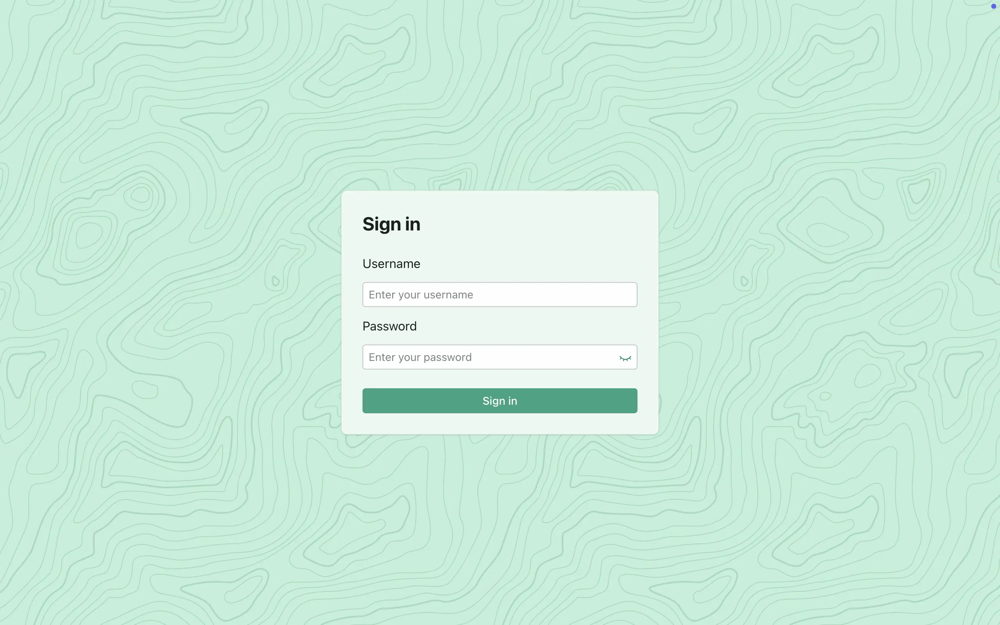

# 软件需求规格说明书

> CSAPP 实验管理系统

## 目录

- [软件需求规格说明书](#软件需求规格说明书)
  - [目录](#目录)
  - [1. 引言](#1-引言)
    - [1.1. 目的](#11-目的)
    - [1.2. 适用人群与阅读建议](#12-适用人群与阅读建议)
    - [1.3. 产品范围](#13-产品范围)
    - [1.4. 参考文献](#14-参考文献)
  - [2. 总体描述](#2-总体描述)
    - [2.1. 产品背景](#21-产品背景)
    - [2.2. 产品功能](#22-产品功能)
    - [2.3. 用户类别与特征](#23-用户类别与特征)
    - [2.4. 操作环境](#24-操作环境)
    - [2.5. 设计与实现约束](#25-设计与实现约束)
    - [2.6. 用户文档](#26-用户文档)
    - [2.7. 假设与依赖](#27-假设与依赖)
  - [3. 外部接口需求](#3-外部接口需求)
    - [3.1. 用户接口](#31-用户接口)
      - [3.1.1. UI1：登录界面](#311-ui1登录界面)
      - [3.1.2. UI2：教师主界面](#312-ui2教师主界面)
      - [3.1.3. UI3：教师学生管理界面](#313-ui3教师学生管理界面)
      - [3.1.4. UI4：教师实验管理界面](#314-ui4教师实验管理界面)
      - [3.1.5. UI5: 学生主界面](#315-ui5-学生主界面)
      - [3.1.6. UI6：学生查看、下载实验材料界面](#316-ui6学生查看下载实验材料界面)
      - [3.1.7. UI7：学生上传实验解答界面](#317-ui7学生上传实验解答界面)
    - [3.2. 软件接口](#32-软件接口)
      - [3.2.1. 用户认证接口](#321-用户认证接口)
      - [3.2.2. 实验管理接口](#322-实验管理接口)
      - [3.2.3. 数据库接口](#323-数据库接口)
      - [3.2.4. 对象存储接口](#324-对象存储接口)
    - [3.3. 通信接口](#33-通信接口)
      - [3.3.1. 认证接口](#331-认证接口)
      - [3.3.2. 公共操作接口](#332-公共操作接口)
      - [3.3.3. 学生操作接口](#333-学生操作接口)
      - [3.3.4. 教师操作接口](#334-教师操作接口)
  - [4. 系统特性](#4-系统特性)
    - [4.1. 认证和授权](#41-认证和授权)
      - [4.1.1. 说明与优先级](#411-说明与优先级)
      - [4.1.2. 激励响应序列](#412-激励响应序列)
        - [4.1.2.1. 登录流程](#4121-登录流程)
        - [4.1.2.2. 资源访问流程](#4122-资源访问流程)
        - [4.1.2.3. 令牌刷新流程](#4123-令牌刷新流程)
        - [4.1.2.4. 登出流程](#4124-登出流程)
      - [4.1.3. 功能需求](#413-功能需求)
      - [4.1.4. 活动图](#414-活动图)
      - [4.1.5. 时序图](#415-时序图)
    - [4.2. 公共操作](#42-公共操作)
      - [4.2.1. 说明与优先级](#421-说明与优先级)
      - [4.2.2. 激励响应序列](#422-激励响应序列)
        - [4.2.2.1. 实验列表查询](#4221-实验列表查询)
        - [4.2.2.2. 实验详情查询](#4222-实验详情查询)
        - [4.2.2.3. 实验材料列表查询](#4223-实验材料列表查询)
        - [4.2.2.4. 实验材料下载](#4224-实验材料下载)
      - [4.2.3. 功能需求](#423-功能需求)
      - [4.2.4. 时序图](#424-时序图)
    - [4.3. 教师操作](#43-教师操作)
      - [4.3.1. 说明与优先级](#431-说明与优先级)
      - [4.3.2. 激励响应序列](#432-激励响应序列)
        - [4.3.2.1. 学生管理](#4321-学生管理)
        - [4.3.2.2. 实验材料管理](#4322-实验材料管理)
        - [4.3.2.2. 学生解答查看](#4322-学生解答查看)
      - [4.3.3. 功能需求](#433-功能需求)
    - [4.3.4. 用例图](#434-用例图)
      - [4.3.5. 时序图](#435-时序图)
    - [4.4. 学生操作](#44-学生操作)
      - [4.4.1. 说明与优先级](#441-说明与优先级)
      - [4.4.2. 激励响应序列](#442-激励响应序列)
      - [4.4.3. 功能需求](#443-功能需求)
      - [4.4.4. 用例图](#444-用例图)
      - [4.4.5. 时序图](#445-时序图)
  - [5. 其他非功能性需求](#5-其他非功能性需求)
    - [5.1. 安全性](#51-安全性)
    - [5.2. 可靠性](#52-可靠性)
  - [6. 其他需求](#6-其他需求)
  - [附录 A. 文件存储规范](#附录-a-文件存储规范)
  - [附录 B. 词汇表](#附录-b-词汇表)

## 1. 引言

### 1.1. 目的

本文档描述了 CSAPP 实验管理系统的功能需求和非功能需求。开发小组的软件系统实现与验证工作都应以此文档为依据。

### 1.2. 适用人群与阅读建议

本文档适用于以下角色：

- 开发人员：重点关注**外部接口需求**、**系统特性**和**其他非功能性需求**等章节
- 测试人员：重点关注**外部接口需求**、**系统特性**和**其他非功能性需求**等章节
- 系统管理员：重点关注**总体描述章节**
- 教师与学生（终端用户）：重点关注**总体描述**章节中的**用户文档**部分

### 1.3. 产品范围

CSAPP 实验管理系统是一个面向南京邮电大学“计算机系统基础”课程（配套教材为 _Computer Systems: A Programmer's Perspective_，简称 _CS:APP_）实验的管理系统，旨在优化该课程的实验流程，改善师生体验。基于此系统，教师将可以更为容易地发布实验材料，学生也可以更方便地提交实验解答。

### 1.4. 参考文献

- 《软件工程 - 实践者的研究方法》
- 《计算机软件需求规格说明规范（GB/T 9385-2008）》

## 2. 总体描述

### 2.1. 产品背景

自南京邮电大学部分整合原有的计算机组成原理、微机接口、汇编语言等课程，开设全新的 “计算机系统基础”课程以来，该课程的配套实验的发布和提交一直是个难题。具体表现在：学生需要自行从 QQ 群、学校服务器等处分散地下载实验材料，在本地或学校服务器环境下使用提供的实验材料进行实验，最后再将实验结果文件及实验报告等提交到服务器指定的文件路径中。

为了优化从实验发布到提交全流程的用户体验，此产品提上了研发日程，旨在部分或完全取代原有的分散的实验管理流程。

此产品是独立开发的新系统。

### 2.2. 产品功能

此产品需要协调“计算机系统基础”实验前后的各项事务，这些事务主要可以根据教师、学生的身份进行划分：

- 教师具有管理和查询功能，功能至少包括：①上传课程大纲，授课计划，实验包等；②查看学生的实验完成情况；③对学生的信息进行管理，如根据名单为学生建立账户和目录等。
- 学生功能至少包括：①下载实验包；②上传实验程序和实验报告。

此外，还需要系统管理员负责一些维护方面的工作。

### 2.3. 用户类别与特征

| 用户类别   | 特征                                               |
| ---------- | -------------------------------------------------- |
| 系统管理员 | 维护基础设施（数据库、存储服务）、执行批量账户创建 |
| 教师       | 创建实验、管理实验资料、管理学生账户、监控实验进度 |
| 学生       | 查看实验说明、下载实验材料、提交实验解答           |

### 2.4. 操作环境

| 组件     | 要求                                              |
| -------- | ------------------------------------------------- |
| 后端     | Java 21、Spring Boot 3、PostgreSQL 17             |
| 前端     | Next.js 15                                        |
| 存储服务 | S3 兼容服务（如果选择完全本地部署，则使用 MinIO） |
| 部署     | Docker Engine 27、Docker Compose                  |

### 2.5. 设计与实现约束

- 系统需要具备高可用性和高安全性
- 系统需要具备良好的性能和响应速度，以保障用户流畅体验
- 使用 RBAC，并使用基于 JWT 令牌技术保护相关 API 端点
- 存储用户密码时，使用加盐的哈希算法（如 BCrypt）处理后存储
- 教师提供的实验材料需按 `labs/{labId}/materials/` 结构存储于 S3 兼容服务
- 学生作业存储路径固定为 `labs/{labId}/solutions/{studentId}/`，存储于 S3 兼容服务

### 2.6. 用户文档

- 部署指南
- 教师操作指南
- 学生操作指南

### 2.7. 假设与依赖

- 假设部署环境已安装 Docker Engine
- 假设部署环境存在足够的磁盘空间用于数据持久化
- 假设部署环境支持校园网访问

## 3. 外部接口需求

### 3.1. 用户接口

该产品的用户界面应采用扁平化设计，使用浅绿色作为主色调，使产品呈现出简洁、自然的外观，给人以轻松、和谐的初见印象。

#### 3.1.1. UI1：登录界面

⽤户进入登录界⾯，需要输入用户名和密码，然后点击按钮进行登录。在实际登录请求发出前，前端界面应验证用户名和密码的合法性；在受到响应后，应能够区分用户身份，页面将基于不同身份自动导航到教师或学生的首页。



#### 3.1.2. UI2：教师主界面

当验证通过并认证为教师身份时，将进入教师主界面。教师可以根据需求选择进入学生管理界面或实验管理界面。


#### 3.1.3. UI3：教师学生管理界面

进入学生管理界面，教师可以添加、删除、修改学生信息。其中，添加操作同时支持单个操作和批量操作，批量操作需要输入 `csv`格式的文本数据，示例文件是 `students.csv`。


#### 3.1.4. UI4：教师实验管理界面

进入实验管理界面，教师可以看到由系统管理员发布的全部实验。点击“材料”列下面的“管理”按钮，即可进入实验材料的上传、下载、删除操作界面；点击“解答”列下面的“检查”按钮，即可进入实验解答管理界面。


#### 3.1.5. UI5: 学生主界面

当验证通过并认证为学生身份时，将进入学生主界面。学生可以进一步进入实验材料下载界面或实验解答上传界面。


#### 3.1.6. UI6：学生查看、下载实验材料界面

进入学生查看、下载实验材料界面，学生可以在实验名称后查看、下载教师上传的相关实验材料，以帮助完成实验。


#### 3.1.7. UI7：学生上传实验解答界面

进入学生上传实验解答界面，完成相关实验后，学生可在对应实验名称后上传自己的解答。


### 3.2. 软件接口

#### 3.2.1. 用户认证接口

该接口用于实现用户身份验证和权限管理，确保系统安全性和数据完整性，包含以下功能：

1. 用户登录认证：接收用户提交的登录信息，验证用户名和密码的合法性
2. 权限管理：基于 JWT 的 Access Token 实现 RBAC 权限控制，区分学生/教师/管理员角色；辅助以随机 UUID 的 Refresh Token

接口规范：

- 接口类型：高层软件功能接口
- 接口协议：HTTP RESTful API
- 数据格式：JSON 格式请求/响应
- 安全性：BCrypt 密码哈希加密，HTTPS 传输，短有效期 Access Token 配合长有效期 Refresh Token

#### 3.2.2. 实验管理接口

处理实验创建、提交文件管理的核心业务逻辑，包含以下功能：

1. 实验材料管理：教师上传/更新实验材料（`*.pdf`、`*.zip`等）
2. 作业提交管理：学生提交实验解答文件（`*.c`、`*.doc`、`*.pdf`等）

接口规范：

- 接口类型：业务逻辑接口
- 存储规范：路径式访问 S3 兼容服务（如 MinIO）
- 路径规范：严格遵循`labs/{labId}/[materials|solutions]`目录结构

#### 3.2.3. 数据库接口

通过 Spring Data JPA 连接 PostgreSQL 数据库，实现数据的持久化存储。具体的配置可以通过环境变量给出，示例如下：

```plain
CSAPP_LAB_MANAGEMENT_SYSTEM_POSTGRES_URL=jdbc:postgresql://localhost:5432/csapp_db
CSAPP_LAB_MANAGEMENT_SYSTEM_POSTGRES_USERNAME=postgres
CSAPP_LAB_MANAGEMENT_SYSTEM_POSTGRES_PASSWORD=your_password
```

#### 3.2.4. 对象存储接口

使用 AWS S3 SDK 访问 S3 兼容服务，实现文件对象的持久化存储和管理。具体的配置可以通过环境变量给出，示例如下：

```plain
CSAPP_LAB_MANAGEMENT_SYSTEM_S3_ENDPOINT=http://127.0.0.1:9000
CSAPP_LAB_MANAGEMENT_SYSTEM_S3_BUCKET_NAME=csapp-lab-management-system-bucket
CSAPP_LAB_MANAGEMENT_SYSTEM_S3_REGION=auto
CSAPP_LAB_MANAGEMENT_SYSTEM_S3_ACCESS_KEY_ID=your_access_key_id
CSAPP_LAB_MANAGEMENT_SYSTEM_S3_SECRET_ACCESS_KEY=your_secret_access_key
```

### 3.3. 通信接口

前后端之间的通信将通过 RESTful API 进行。至少包括以下 API：

#### 3.3.1. 认证接口

- `POST /api/auth/login`：登录接口

#### 3.3.2. 公共操作接口

- `GET /api/status`：检测系统可用性
- `GET /api/public/labs`：获取实验列表
- `GET /api/public/labs/{labId}`：获取特定实验的具体信息
- `GET /api/public/labs/{labId}/materials`：获取特定实验的实验材料的列表
- `GET /api/public/labs/{labId}/materials/{fileName}`：获取特定实验材料的文件流（用于下载）

#### 3.3.3. 学生操作接口

- `POST /api/students/labs/{labId}/solutions`：上传实验解答
- `GET /api/students/labs/{labId}/solutions`：获取实验解答文件列表
- `GET /api/students/labs/{labId}/solutions/{fileName}`：获取特定实验解答文件的文件流（用于下载）
- `DELETE /api/students/labs/{labId}/solutions/{fileName}`：删除特定实验解答文件
- `GET /api/students/status`：检测系统可用性

#### 3.3.4. 教师操作接口

- `GET /api/teachers/students`：获取学生列表
- `POST /api/teachers/students`：向系统中添加一个学生
- `PUT /api/teachers/students/{studentId}`：更新特定学生的学生信息
- `DELETE /api/teachers/students/{studentId}`：从系统中删除特定学生
- `POST /api/teachers/labs/{labId}/materials`：向系统中的某个实验添加实验材料的上传接口
- `DELETE /api/teachers/labs/{labId}/materials/{fileName}`：删除系统中某个实验的特定实验材料文件
- `GET /api/teachers/labs/{labId}/solutions/{studentId}`：获取特定学生对特定实验的解答文件的列表
- `GET /api/teachers/labs/{labId}/solutions/{studentId}/{fileName}`：获取特定解答文件的文件流（用于下载）
- `GET /api/teachers/status`：检测系统可用性

## 4. 系统特性

### 4.1. 认证和授权

#### 4.1.1. 说明与优先级

系统应使用 Spring Security 保护相关 API 接口，并实现基于角色的访问控制（RBAC）。

优先级：高

#### 4.1.2. 激励响应序列

##### 4.1.2.1. 登录流程

激励：用户提供登录凭证

响应：系统验证用户身份，根据用户角色（教师/学生）生成并返回JWT访问令牌和UUID刷新令牌

##### 4.1.2.2. 资源访问流程

激励：用户请求访问受保护资源

响应：系统验证用户令牌有效性及角色权限，根据角色（教师/学生）返回对应权限的资源

##### 4.1.2.3. 令牌刷新流程

激励：客户端请求刷新过期访问令牌

响应：系统验证刷新令牌并生成新的访问令牌，保持用户角色和权限不变

##### 4.1.2.4. 登出流程

激励：用户请求退出系统

响应：系统使当前令牌失效并清除用户会话信息

#### 4.1.3. 功能需求

需求1：系统应支持用户通过用户名和密码进行身份验证

需求2：系统应基于用户角色（教师/学生）生成包含相应权限的 JWT Access Token（访问令牌）

需求3：系统应生成 UUID Refresh Token（刷新令牌）用于延长会话有效期

需求4：系统应根据用户角色实现基于角色的访问控制（RBAC）

需求5：系统应验证访问令牌的有效性，包括签名验证和过期检查

需求6：系统应提供令牌刷新机制，在保持用户权限不变的情况下更新访问令牌

需求7：系统应提供安全的登出功能，使当前会话的所有令牌失效

需求8：系统应维护令牌黑名单，防止已登出的令牌被重用

#### 4.1.4. 活动图


#### 4.1.5. 时序图


### 4.2. 公共操作

#### 4.2.1. 说明与优先级

公共操作指的是无论身份是学生（Student）还是教师（Teacher），都可以进行的操作。

优先级：高

#### 4.2.2. 激励响应序列

##### 4.2.2.1. 实验列表查询

激励：用户请求查看实验列表

响应：系统返回实验列表信息

##### 4.2.2.2. 实验详情查询

激励：用户请求查看特定实验详情

响应：系统返回该实验的详细信息

##### 4.2.2.3. 实验材料列表查询

激励：用户请求查看特定实验的材料列表

响应：系统返回该实验的所有材料列表

##### 4.2.2.4. 实验材料下载

激励：用户请求下载特定实验材料

响应：系统提供材料文件的下载流

#### 4.2.3. 功能需求

需求9：系统应允许认证用户查询所有可用实验的列表

需求10：系统应允许认证用户查看特定实验的详细信息

需求11：系统应允许认证用户查询特定实验的所有相关材料列表

需求12：系统应允许认证用户下载特定实验的材料文件

#### 4.2.4. 时序图


### 4.3. 教师操作

#### 4.3.1. 说明与优先级

教师操作是身份为教师的用户可以进行的操作。

优先级：高

#### 4.3.2. 激励响应序列

##### 4.3.2.1. 学生管理

- 激励：教师请求查看学生列表；响应：系统返回所有学生信息列表
- 激励：教师提交新学生信息；响应：系统添加学生记录并确认成功
- 激励：教师提交学生信息更新；响应：系统更新学生记录并确认成功
- 激励：教师请求删除特定学生；响应：系统删除学生记录并确认成功

##### 4.3.2.2. 实验材料管理

- 激励：教师上传实验材料；响应：系统存储材料并确认上传成功
- 激励：教师请求删除特定实验材料；响应：系统删除材料并确认成功

##### 4.3.2.2. 学生解答查看

- 激励：教师请求查看学生实验解答列表；响应：系统返回指定学生的解答列表
- 激励：教师请求下载特定学生解答；响应：系统提供学生解答文件的下载流

#### 4.3.3. 功能需求

需求13：系统应允许教师用户查看所有学生的列表信息

需求14：系统应允许教师用户添加新的学生账户

需求15：系统应允许教师用户更新现有学生的个人信息

需求16：系统应允许教师用户删除特定学生账户

需求17：系统应允许教师用户上传实验教学材料

需求18：系统应允许教师用户删除已上传的实验材料

需求19：系统应允许教师用户查看学生提交的实验解答列表

需求20：系统应允许教师用户下载特定学生的实验解答文件

### 4.3.4. 用例图


#### 4.3.5. 时序图

注意：图中省略了从 JWT 中提取身份信息的操作。如果 JWT 中身份不包含 Teacher，则应返回 401 Unauthorized。


### 4.4. 学生操作

#### 4.4.1. 说明与优先级

学生操作是指身份为学生的用户可以进行的操作。

优先级：高

#### 4.4.2. 激励响应序列

激励：学生上传实验解答

响应：系统存储解答并确认上传成功

激励：学生请求查看自己的解答列表

响应：系统返回学生本人的解答列表

激励：学生请求下载自己的解答文件

响应：系统提供学生解答文件的下载流

激励：学生请求删除自己的解答文件

响应：系统删除解答文件并确认成功

#### 4.4.3. 功能需求

需求21：系统应允许学生用户上传实验解答文件

需求22：系统应允许学生用户查看自己提交的所有实验解答列表

需求23：系统应允许学生用户下载自己之前提交的实验解答文件

需求24：系统应允许学生用户删除自己提交的特定实验解答文件

#### 4.4.4. 用例图


#### 4.4.5. 时序图

注意：图中省略了从 JWT 中提取身份信息的操作。如果 JWT 中身份不包含 Teacher，则应返回 401 Unauthorized。


## 5. 其他非功能性需求

### 5.1. 安全性

- 密码存储：服务端将用户密码存入数据库时，应使用带盐哈希算法（如 BCrypt）处理真实密码。确保存储哈希后的结果，原密码不落库。
- 传输安全：所有 API 强制使用 HTTPS。

### 5.2. 可靠性

- 如果使用本地 S3 兼容服务方案（MinIO），则应采取适当措施进行数据冗余。
- 对于数据库，定期进行全量备份。

## 6. 其他需求

该产品应支持国际化，优先支持的语言包括中文、英文。

## 附录 A. 文件存储规范

```plain
labs/
├── LAB001/
│   ├── materials/
│   │   └── lab1.pdf
│   └── solutions/
│       ├── STU001/
│       │   └── answer.c
│       └── STU002/
│           └── report.pdf
└── LAB002/
    └── ... 
```

## 附录 B. 词汇表

- CS:APP：指的是《深入理解计算机系统》（英文原名：_Computer Systems A Programmer's Perspective_）
- S3：指的是最初由 Amazon 推出的 Simple Storage Service。
- S3 兼容服务：指的是兼容 Amazon S3 的各类服务，包括阿里云 OSS、腾讯云 COS、Cloudflare R2、MinIO 等
- RBAC：指的是“基于角色的访问控制”（Role-Based Access Control）
- JWT：指的是 JSON Web Token，一种基于 JSON 格式的令牌格式
- Access Token：访问令牌，可以用于访问受限资源，有效期一般较短
- Refresh Token：刷新令牌，用于刷新获取新的 Access Token，有效期相对较长
